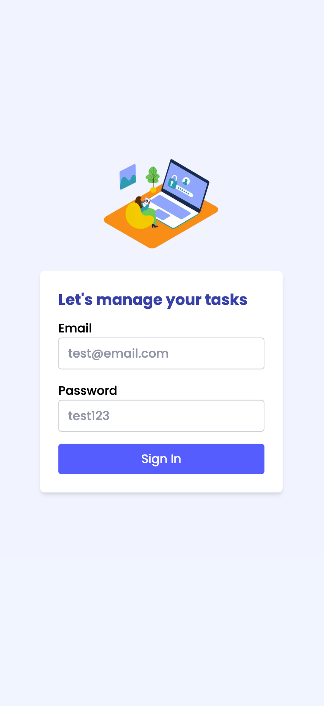
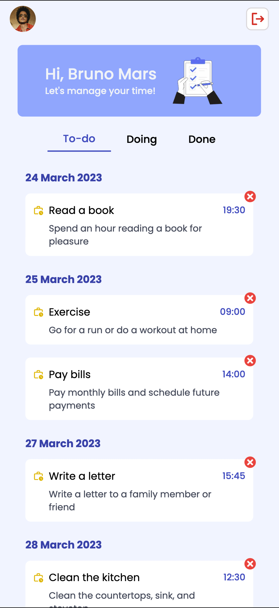
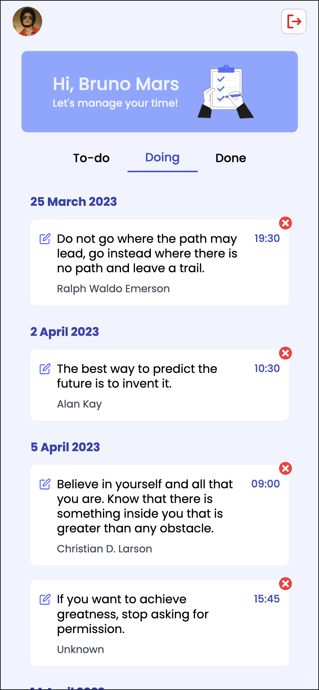
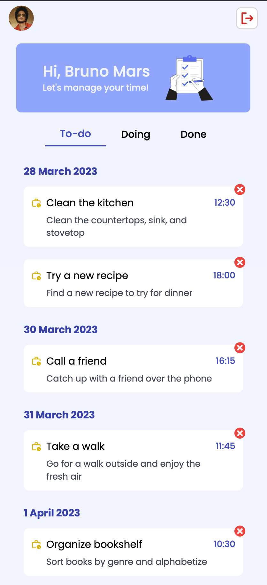
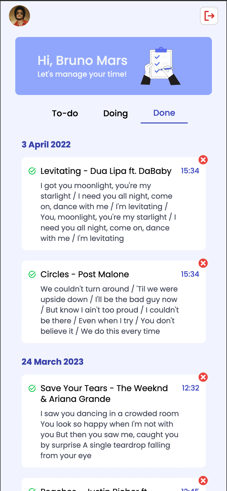

# Task Management

A lightweight task management web app built with Next.js 14, TypeScript and Tailwind CSS. It demonstrates authentication with NextAuth, client-side UI components, and simple task list features.

An API-driven task management system that fetches data for personal reminders and categorizes tasks into TODO, DOING, and DONE.
Website: [https://task-management-web.vercel.app/](url)

## Features

- Next.js 14 (App Router)
- TypeScript
- Tailwind CSS for styling
- NextAuth for authentication
- Reusable UI components (tabs, avatar, skeleton loaders)

## Quick start

Prerequisites:

- Node.js (>= 18) and npm or yarn

Install dependencies:

```bash
npm install
# or
yarn
```

Run in development:

```bash
npm run dev
```

Build for production:

```bash
npm run build
npm start
```

Other helpful scripts:

- `npm run lint` — run ESLint (uses Next's config)
- `npm run prettier:check` — check formatting with Prettier
- `npm run prettier:format` — format project with Prettier

## Project structure

Top-level folders and purpose (important files):

- `app/` — Next.js App Router pages and layouts
  - `layout.tsx` — global app layout
  - `login/`, `api/`, and `(withNav)/` — feature pages and routes
- `components/` — React components and UI building blocks
  - `index/` — main page components (TodoLists, WelcomeUser, TabTodoList)
  - `login/` — login UI
  - `nav/` — navigation UI
  - `shadui/` and `ui/` — small UI primitives (avatar, tabs, skeletons)
- `services/` — API client and related utilities (`api-client.ts`, models)
- `libs/` — shared utilities
- `types/` — TypeScript types
- `public/` — static assets (images)

## Demo






